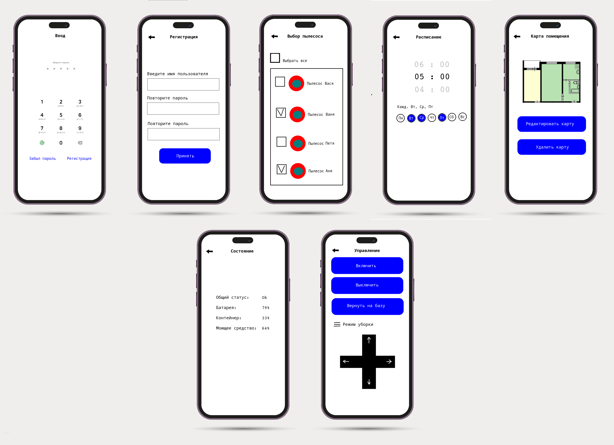

# Домашнее задание для десятого семинара "Урок 10. Структура приложения с пользовательским интерфейсом и базой данных (паттерн Repository)"

  1. Разработать UseCase диаграмму для приложения управления роботом пылесосом
  2. Разработать UI/UX мобильного приложения управления роботом пылесосом

## 1. UseCase диаграмма для приложения управления роботом пылесосом

Постарался выбрать всё что придумалось. Больше чего-то не придумывается.

## 2. UI/UX мобильного приложения управления роботом пылесосом

Я не стал детально прорисовывать дополнительные экраны, на которых, к примеру, находятся просто кнопки выбора автоматическое управление или ручное, нарисовал только самые основные.

