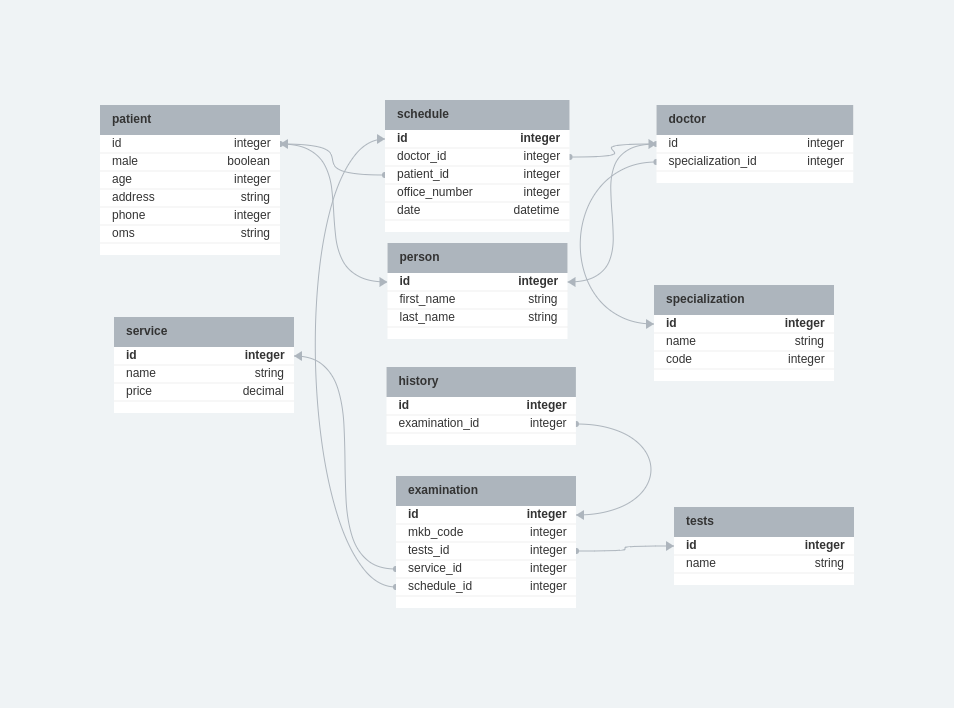
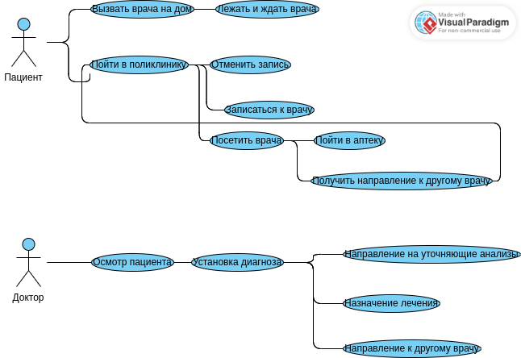

# Домашнее задание для шестого семинара "Архитектура ПО, Урок 6. Принципы построения приложений «чистая архитектура».

Сделал как мог. Потратил два дня на два задания и всё равно получилось мало. Ну не умею я пользоваться графическими редакторами! Вообще никакими. Наверное я бы лучше от руки нарисовал, сфотографировал телефоном и отослал бы, всё бы было быстрее и более "нажористо" чем три с половиной связи в UseCase. Но, во-первых, у меня ужасный почерк :-) А во-вторых так нельзя, надо изучать те средства, которые рекомендованы на семинарах...

Так что сделал как смог, как смог...

## 1. ER диаграмма клиники:

## 2. Use Case диаграмма клиники:

