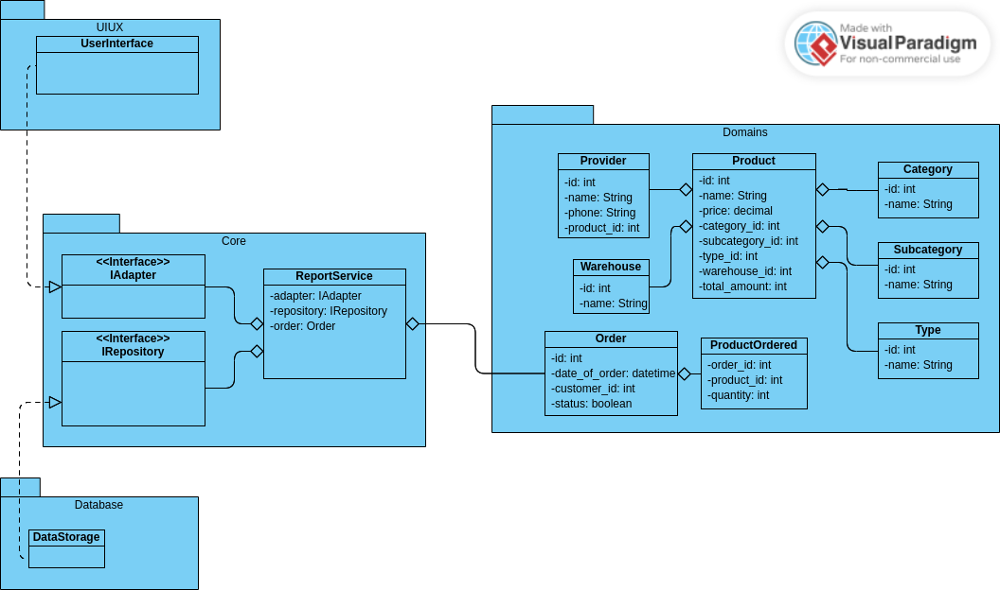

# Домашнее задание для седьмого семинара "Архитектура ПО, Урок 7. Типа архитектур WEB-приложений: MPA, SPA.

*Доработать экранные формы интерфейса в https://www.figma.com/, https://pixso.net/ru/ или https://app.diagrams.net/.*
*Разработать полную ERD домена в https://www.dbdesigner.net/.*
*Разработать диаграмму компонент в UML включая слои пользовательского интерфейса и бизнес-логики.*
*Все диаграммы сделать к разработанному на семинаре примеру системы отчетов оптовой компании.*

## 1. UI/UX отчёта оптовой компании

Использовал Qt Designer из комплекта библиотеки [Qt](https://www.qt.io/). Я далеко не дизайнер, поэтому что получилось, то и получилось.

## 2. ER диаграмма оптовой компании

Есть `product` с определённым названием ценой `product.price`, принадлежащий определённой категории `category`, подкатегории `subcategory` и типу `type`. Хранится на определённом складе `warehouse` в количестве `product.total_amount` штук. Завёз его туда `provider`. Когда `customer` делает заказ `order` то все заказанные продукты собираются в отдельные `product_ordered` в количестве `product_ordered.quantity` каждого продукта и благодаря ссылке `gocery_list.order_id` привязываются к определённому заказу именно данного покупателя. Общую стоимость заказа можно посчитать потому что в `product_ordered` указывается количество продуктов и ссылка на сам продукт, откуда спокойно достаётся его цена. А выкуплен заказ или пока ещё нет видно по булевскому полю `order.status`.

Я не стал там ничего сильно мудрёного изобретать, надо будет, то есть заказчик если попросит, вот тогда и будем делать навороты ;-)

Вот как-то так.

## 2. UML диаграмма оптовой компании

Я постарался сделать чтобы лиаграмма UML соответствовала ERD, правда никакие методы ни в одном классе, ни в одном интерфейсе не придумывал и не называл, только поля.

