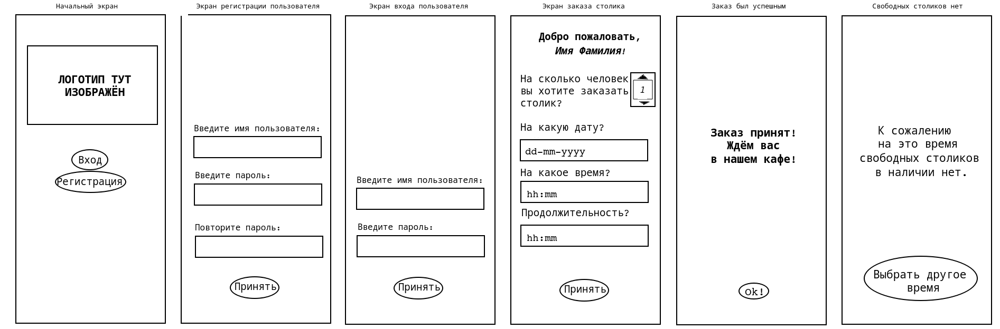
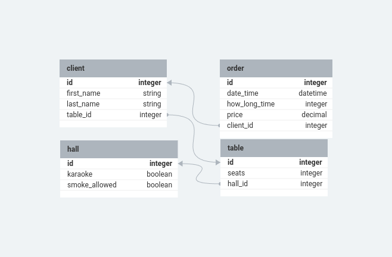
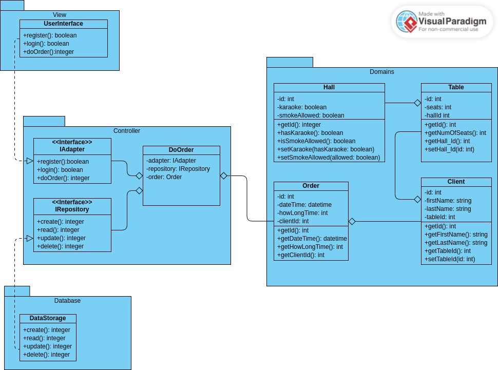

# Домашнее задание для восьмого семинара "Урок 8. Типы архитектур прикладных приложений (мобильные): MVC, MVP, MVVM."

Для приложения заказа столика в ресторане сделать архитектурные документы:
    1. Разработать экранные формы интерфейса(UI/UX) в https://www.figma.com/, https://pixso.net/ru/ или https://app.diagrams.net/.
    2. Разработать полную ERD домена в https://www.dbdesigner.net/.
    3 Разработать UML диаграмму классов

## 1. UI/UX заказа столика в кафе

В комментариях к моему домашнему заданию к семинару №6 вы сказали:

> Использование предложенных инструментов для создания диаграмм не строго обязательное. Вы можете использовать любой графический редактор. Работу, выполненную от руки, тоже приму...Но это не очень приветствуется, т.к. в будущем на работе от вас будут ждать определенных навыков.

Я так и не смог разобраться ни с Figma, ни с его клоном Pixso. Поэтому нарисовал UI/UX практически от руки, то есть в обычном редакторе Paint.

## 2. ER диаграмма заказа столика в кафе

В таблице `table` есть `id` столика, количество мест `seats` и ссылка на зал `hall_id` в котором находится этот столик.

В таблице `hall` есть `id` зала и булевы переменные, показывающие есть лии в этом зале караоке `karaoke` и можно ли в нём курить `smoke_allowed`

В таблице `client` есть `id` клиента, его имя `first_name`, фамилия `last_name` и ссылка на столик, который он заказал `table_id`

В таблице заказов `order` есть `id` заказа, время заказа `date_time`, на сколько часов заказан столик (продолжительность заказа) `how_long_time`, цена заказа `price` и ссылка на клиента, который сделал данный заказ `client_id`.

## 2. UML диаграмма заказа столика в кафе

Хотя все имена методов я давал в CamelCase, имена методов `getHall_Id` и `setHall_Id` в классе `Table` я дал в смешанном camel-snake case чтобы строчная буква 'l' не сливалась с заглавной 'I' при чтении.

