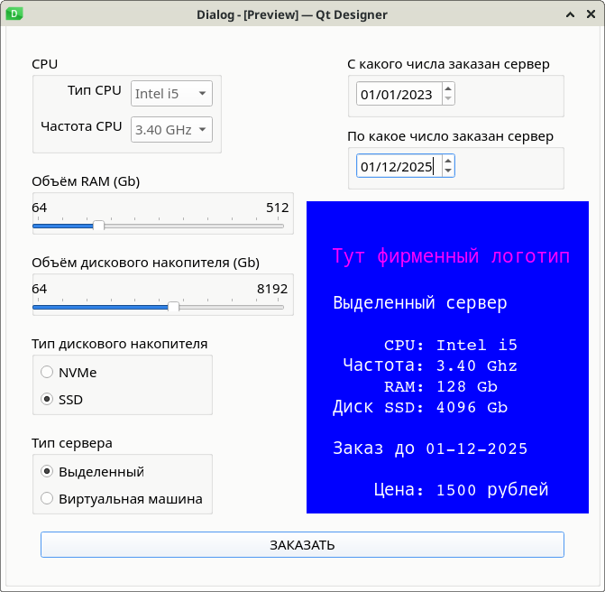
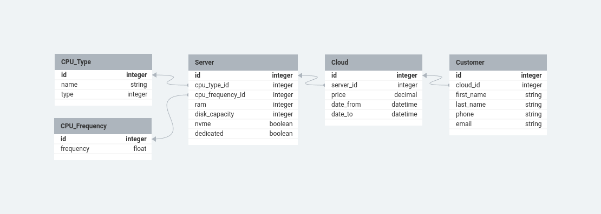

# Домашнее задание для девятого семинара "Урок 9. Способы организации передачи данных между компонентами приложения, протоколы и API. REST, gRPC, очереди"

Подготовить архитектурные документы к проекту заказа ресурсов в облаке:

    1. Разработать экранные формы интерфейса для заказа ресурсов в облачном сервисе в https://www.figma.com/ или https://app.diagrams.net/.
    2. Разработать полную ERD домена в https://www.dbdesigner.net/.
    3. Добавить в OPENAPI разработанный на семинаре одну команду (DELETE) Код OPENAPI разработанный на семинаре приложен к материалам урока.

## 1. UI/UX проекта заказа ресурсов в облаке



## 2. ER диаграмма проекта заказа ресурсов в облаке

### Описание таблиц и полей

Таблица `CPU_Type`

- `id`
- `name`: название CPU (i3, i5, i7, Ryzen)
- t`ype`: тип CPU  (i3, i5, i7, Ryzen)

Таблица `CPU_Frequency`

- `id`
- `frequency`: частота CPU

Таблица `Server`

- `id`
- `cpu_type_id`: ссылка на тип CPU
- `cpu_frequency_id`: ссылка тактовую частоту CPU
- `ram`: объём памяти
- `disk_capacity`: объём дискового накопителя
- `nvme`: если True, то диск NVMe, иначе SSD
- `dedicated`: если True, то выделенный сервер, иначе VM

Таблица `Cloud`

- `id`
- `server_id`: ссылка на конфигурацию сервера для этого cloud
- `price`: цена этого cloud
- `date_from`: дата когда был куплен этот cloud
- `date_to`: дата до которой куплен этот cloud

Таблица `Customer`

- `id`
- `cloud_id`: ссылка на cloud, который купил данный покупатель
- `first_name`: имя покупателя
- `last_name`: фамилия покупателя
- `phone`: телефон покупателя
- `email`: e-mail покупателя




## 3. Добавление в `openapi.yaml` команды DELETE

```
openapi: 3.0.0
info:
  title: Заказ ресурсов на облаке
  version: 0.0.1
servers:
  - url: http://localhost:8080/api/v1/
    description: Dev server
paths:
  /clouds:
    get:
      summary: Метод получения списка ресурсов на облако
      tags:
        - Clouds
      operationId: getAllClouds
      responses:
        "200":
           description: Успешный ответ со списком ресурсов в облаке
           content:
             application/json:
               schema:
                 $ref: "#/components/schemas/Clouds"
        "default":
           description: Все остальное
           content:
             application/json:
               schema:
                 $ref: "#/components/schemas/Error"
    post:
      summary: Создание заказа на облако
      tags:
        - Clouds
      operationId: CreateCloud
      requestBody:
        content:
          application/json:
            schema:
              $ref: "#/components/schemas/Error"
      responses:
        "200":
           description: Успешный ответ со списком ресурсов в облаке
           content:
             application/json:
               schema:
                 $ref: "#/components/schemas/Clouds"
        "default":
           description: Все остальное
           content:
             application/json:
               schema:
                 $ref: "#/components/schemas/Error"
  /clouds/{cloud_id}:
    get:
      summary: Метод получения заказа на облако по ID
      tags:
        - Clouds
      operationId: getCloudById
      parameters:
        - name: cloud_id
          in: path
          required: true
          description: Идентификатор заказа облака
          schema:
            type: string
          example: f102b615
      responses:
        "200":
           description: Успешный ответ заказом облака по ID
           content:
             application/json:
               schema:
                 $ref: "#/components/schemas/Cloud"
        "404":
           description: Заказ с ID не найден
           content:
             application/json:
               schema:
                 $ref: "#/components/schemas/Error"
        "default":
           description: Все остальное
           content:
             application/json:
               schema:
                 $ref: "#/components/schemas/Error"
    delete:
      summary: Метод удаления заказа на облако по ID
      tags:
        - Clouds
      operationId: deleteCloudById
      parameters:
        - name: cloud_id
          in: path
          required: true
          description: Идентификатор заказа облака
          schema:
            type: string
          example: f102b615
      responses:
        "200":
           description: Успешное удаление облака по ID
           content:
             application/json:
               schema:
                 $ref: "#/components/schemas/Cloud"
        "404":
           description: Заказ с ID не найден
           content:
             application/json:
               schema:
                 $ref: "#/components/schemas/Error"
        "default":
           description: Все остальное
           content:
             application/json:
               schema:
                 $ref: "#/components/schemas/Error"
components:
  schemas:
    Cloud:
      type: object
      required:
        - id_client
        - OS
        - RAM
        - CPU
        - HDD
      properties:
        cloud_id:
          type: string
          example: f102b615
        id_client:
          type: string
          example: f102b615
        OS:
          type: string
          enum:
            - Windows
            - Linux
          description: Операционная система сервера
        RAM:
          type: string
          example: 128
          description: Объем оперативной памяти
        CPU:
          type: string
          example: 8
          description: Количество ядер процессора
    Clouds:
      type: array
      items:
        $ref: "#/components/schemas/Cloud"
    Error:
      type: object
      required:
        - code
        - message
      properties:
        code:
          type: integer
        message:
          type: string
```
